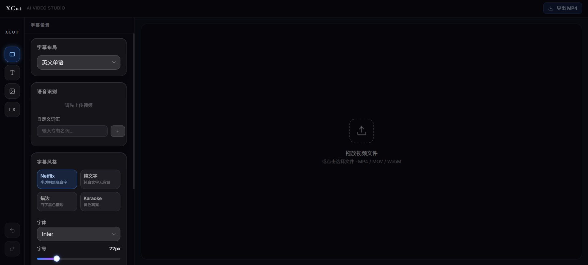
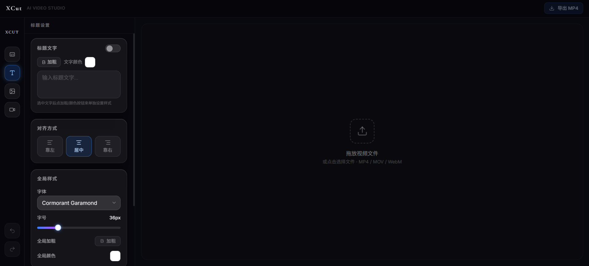
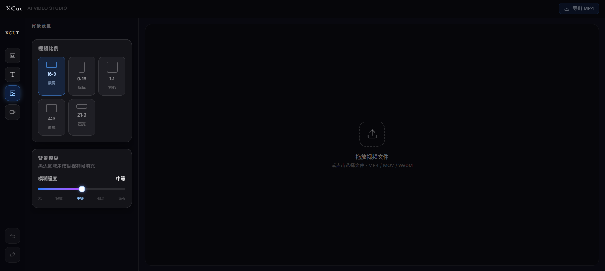
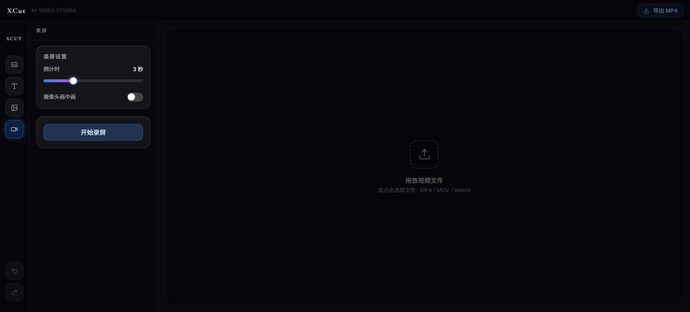

# XCut — AI Video Studio

<p align="center">
  
</p>

<p align="center">
  
  
  
  
  
  
</p>

<p align="center">
  <a href="#english">English</a> · <a href="#中文">中文</a>
</p>

---

## English

**XCut** is a fully browser-based AI video subtitle editor. All processing runs locally — no video is ever uploaded to a server, keeping your content completely private.

### Screenshots

| Subtitle Settings | Title Settings |
|---------|---------|
|  |  |

| Background & Aspect Ratio | Screen Recording |
|-----------|---------|
|  |  |

### Features

| Feature | Description |
|---------|-------------|
| AI Speech Recognition | Whisper-based automatic subtitle generation, runs entirely in the browser via WebGPU |
| Bilingual Subtitles | Chinese/English single-language or dual-language display (4 layout modes) |
| Subtitle Styles | Netflix, plain text, stroke, Karaoke — with per-word font, size, bold, and color controls |
| Rich Text Titles | Per-character bold/color formatting; drag to any position; left/center/right alignment |
| Aspect Ratios | 16:9, 9:16, 1:1, 4:3, 21:9 |
| Gaussian Blur Background | Fills letterbox areas with a blurred video frame (5 intensity levels) |
| Timeline Editing | Split, delete, and trim video clips on a visual timeline |
| Screen Recording | Record screen + camera PiP composite, with audio sync |
| Real-time Preview | Canvas-based preview with draggable seek bar; changes reflect instantly |
| Undo / Redo | Global history up to 50 steps (`Ctrl+Z` / `Ctrl+Shift+Z`) |
| Export MP4 | Burns subtitles, titles, and background effects directly into the output video |
| Export SRT | Export subtitle-only file |

### Quick Start

**Prerequisites:** Node.js 18+ and a Chromium-based browser (Chrome 130+ or Edge latest recommended).

> The project includes a `.npmrc` that sets `legacy-peer-deps=true`. This is needed because `@tailwindcss/vite` has not yet updated its peer dependency declaration to include Vite 8, even though it works fine with it. `npm install` will succeed without any extra flags.

```bash
# Clone the repository (requires Git — https://git-scm.com)
git clone https://github.com/marcosoccer211/xcut.git
cd xcut

# No Git? Download the ZIP instead:
# https://github.com/marcosoccer211/xcut/archive/refs/heads/main.zip
# Then unzip and cd into the folder.

# Install dependencies (works out of the box — .npmrc handles peer dep resolution)
npm install

# Start the development server
npm run dev
```

Open `http://localhost:5173` in your browser.

```bash
# Build for production
npm run build
```

> **Note:** The app requires `COOP: same-origin` and `COEP: require-corp` headers (needed for SharedArrayBuffer / FFmpeg WASM). `npm run dev` sets these automatically via Vite config. For production deployment, configure your server to send these headers.

### Keyboard Shortcuts

| Shortcut | Action |
|----------|--------|
| `Ctrl + Z` | Undo |
| `Ctrl + Shift + Z` | Redo |
| Drag progress bar | Seek to time |

### System Requirements

- **Browser:** Chrome 130+ or Edge (latest). Requires WebAssembly, Web Workers, and Canvas API.
- **RAM:** 8 GB+ recommended for large video files.
- **Storage:** ~200 MB for the Whisper model cache (downloaded once, then cached in the browser).

### Tech Stack

| Layer | Technology |
|-------|------------|
| Framework | React 19 + TypeScript + Vite 8 |
| Styling | Tailwind CSS v4 + Framer Motion |
| AI Recognition | `@huggingface/transformers` — Whisper small, WebGPU accelerated |
| Export | MediaRecorder (canvas recording) + `@ffmpeg/ffmpeg` (WebM→MP4 fallback) |
| Translation | MyMemory free API |
| State | Zustand v5 with undo/redo history |
| Fonts | Inter · Cormorant Garamond · Noto Serif SC · Plus Jakarta Sans |

### Directory Structure

```
xcut/
├── public/                     # Static assets
├── docs/
│   ├── presentation.html       # Portfolio slide deck (pure HTML/CSS/JS)
│   └── screenshots/            # README screenshots
├── src/
│   ├── types/index.ts          # All TypeScript type definitions
│   ├── stores/projectStore.ts  # Zustand global state + undo/redo
│   ├── constants/
│   │   └── vocabulary.ts       # AI/Crypto vocabulary + Whisper prompt builder
│   ├── lib/
│   │   ├── drawFrame.ts        # ★ Core canvas rendering (preview + export share this)
│   │   └── utils.ts            # Helpers: aspect ratio, time formatting, etc.
│   ├── workers/
│   │   └── asr.worker.ts       # Whisper Web Worker (LOAD / TRANSCRIBE messages)
│   └── components/
│       ├── layout/Sidebar.tsx          # Left navigation + undo/redo buttons
│       ├── export/ExportButton.tsx     # MP4 + SRT export logic
│       ├── preview/VideoPreview.tsx    # Canvas preview + playback + multi-clip seek
│       ├── timeline/TimelineBar.tsx    # Timeline editor (split / delete / trim)
│       └── panels/
│           ├── SubtitlePanel.tsx       # Subtitle UI + ASR + style controls
│           ├── TitlePanel.tsx          # Rich text title editor
│           ├── BackgroundPanel.tsx     # Aspect ratio + blur settings
│           └── RecordingPanel.tsx      # Screen + camera PiP recording
├── index.html
├── vite.config.ts
├── package.json
└── CLAUDE.md                   # Architecture notes for AI assistants / contributors
```

### Roadmap

- [ ] Export progress bar during FFmpeg transcoding
- [ ] Bilingual mode support for Chinese audio source
- [ ] Export resolution selector (currently fixed at 1280px width)
- [ ] Title animation effects (fade-in, typewriter)
- [ ] Multiple title segments (different titles at different timestamps)
- [ ] Offline PWA (cache model + FFmpeg)
- [x] Timeline editing (split / delete / trim)
- [x] Screen recording with camera PiP
- [x] Multi-clip export

### Contributing

Contributions, issues, and feature requests are welcome!

1. Fork the repository
2. Create a feature branch: `git checkout -b feature/my-feature`
3. Make your changes and run lint: `npm run lint`
4. Commit your changes: `git commit -m 'Add my feature'`
5. Push to the branch: `git push origin feature/my-feature`
6. Open a Pull Request

Please read `CLAUDE.md` for a detailed architecture overview before making larger changes.

### License

Distributed under the [MIT License](LICENSE).

---

## 中文

**XCut** 是一款运行在浏览器里的 AI 视频字幕编辑工具。所有处理均在本地完成，无需上传视频到服务器，保护你的隐私。

### 截图预览

| 字幕设置 | 标题设置 |
|---------|---------|
|  |  |

| 背景与比例 | 录屏功能 |
|-----------|---------|
|  |  |

### 功能一览

| 功能 | 说明 |
|------|------|
| AI 语音识别 | 基于 Whisper 模型，自动识别视频语音并生成字幕 |
| 双语字幕 | 支持中英文单语或双语同时显示（英上中下 / 中上英下 / 无字幕） |
| 视频语言选择 | 中文单语模式下可选「英文视频」（识别后自动翻译为简体中文）或「中文视频」（直接识别） |
| 简体中文输出 | 字幕翻译和直接识别均输出简体中文 |
| 专有名词识别 | 内置 AI / Crypto 词库，可自定义词汇提升识别准确率 |
| 字幕样式 | Netflix 风、纯文字、描边、Karaoke 四种预设；支持加粗、颜色、字号独立调整 |
| 双语合并框 | Netflix / Karaoke 风格下，中英文字幕合并在同一个背景框内 |
| 标题覆层 | 富文本标题：可对单个字/词设置加粗、颜色；支持换行、左/居中/右对齐；位置任意拖动 |
| 视频比例 | 支持 16:9 / 9:16 / 1:1 / 4:3 / 21:9 五种比例 |
| 高斯模糊背景 | 比例变换产生的黑边用模糊视频帧填充（5 个等级） |
| 时间轴剪辑 | 可视化时间轴，支持分割、删除、修剪视频片段 |
| 录屏功能 | 屏幕录制 + 摄像头画中画合成，音画同步 |
| 实时预览 | 所有改动即时反映到 canvas 预览画面，进度条可拖拽 seek |
| 撤销 / 重做 | 全局操作历史，最多保存 50 步（字幕识别结果不计入历史） |
| 导出 MP4 | Canvas 录制方式导出，字幕 + 标题 + 背景效果全部烧录进视频 |
| 导出 SRT | 单独导出字幕文件 |

### 快速开始

**环境要求：** Node.js 18+，Chrome 130+ 或 Edge 最新版。

> 项目内置 `.npmrc`（`legacy-peer-deps=true`），直接 `npm install` 即可，无需加任何额外参数。原因：`@tailwindcss/vite` 的 peer dep 声明尚未更新到支持 Vite 8，但实际上运行完全正常。

```bash
# 需要先安装 Git：https://git-scm.com
git clone https://github.com/marcosoccer211/xcut.git
cd xcut

# 没有 Git？也可以直接下载 ZIP：
# https://github.com/marcosoccer211/xcut/archive/refs/heads/main.zip
# 解压后进入文件夹，再继续后续步骤。

npm install
npm run dev
```

在浏览器打开 `http://localhost:5173` 即可使用。

```bash
# 构建生产版本
npm run build
```

> **说明：** 本地开发服务器已自动配置 `COOP` / `COEP` 安全头（FFmpeg WASM 所需）。生产部署时需在服务器侧配置这两个响应头。

### 操作指南

#### 第一步：上传视频

在右侧预览区域，将视频文件拖放进去，或点击区域选择文件。
支持格式：MP4、MOV、WebM 等主流格式。

#### 第二步：生成字幕（字幕面板）

点击左侧侧边栏第一个图标（字幕），进入字幕设置。

**选择字幕布局：**
- `无字幕` — 不显示字幕
- `英文单语` — 只显示英文字幕
- `中文单语` — 只显示中文字幕
- `英上中下` — 英文在上，中文在下（双语）
- `中上英下` — 中文在上，英文在下（双语）

**中文单语模式下，选择视频语言：**
- `英文视频`（默认）— Whisper 识别英文，自动翻译为简体中文，只显示中文字幕
- `中文视频` — Whisper 直接识别普通话，输出简体中文

**添加专有名词（可选）：**
在「自定义词汇」输入框中输入专有名词（如频道名、项目名），按 Enter 添加。
工具已内置 AI 领域词库（Claude、GPT、RAG 等）和 Crypto 词库（Bitcoin、DeFi 等）。

**开始识别：**
点击「开始识别」按钮。首次使用需要下载 Whisper 模型（约 200MB），请耐心等待。
进度条会实时显示识别进度。双语模式下识别后会自动翻译。

**编辑字幕片段：**
识别完成后，下方会出现所有字幕片段列表。
- 点击片段可展开编辑英文或中文文字
- 点击 × 删除该片段

#### 第三步：调整字幕样式

| 预设 | 效果 |
|------|------|
| Netflix | 半透明黑底白字，圆角背景块 |
| 纯文字 | 只有白色文字，无背景 |
| 描边 | 白色文字加黑色描边 |
| Karaoke | 黄色文字，半透明背景 |

还可以单独调整：
- **字体**：英文（Inter / Cormorant Garamond / Plus Jakarta Sans）、中文（思源宋体）
- **字号**：滑块拖动调整大小
- **加粗**：英文和中文可独立设置
- **颜色**：点击色块选取颜色

> 双语 Netflix / Karaoke 模式下，中英文会显示在同一个背景框内，「字幕位置」只显示一组控制项。

#### 第四步：调整字幕位置

在「字幕位置」区域，通过滑块调整字幕的水平和垂直位置（0% = 最左/最上，100% = 最右/最下）。
双语 + 纯文字/描边模式下，英文和中文的位置可以独立调整。

#### 第五步：添加标题（标题面板）

1. 打开右上角的开关启用标题
2. 在文本框中输入标题内容，按 **Enter** 换行
3. **对单个字/词设置样式**：选中文字后点击「加粗」按钮或颜色选择器
4. 设置对齐方式：靠左 / 居中 / 靠右
5. 在「全局样式」中调整字体、字号、全局加粗、全局颜色
6. 用位置滑块将标题拖到视频上任意位置

> 提示：标题适合放在视频上下黑边区域（比如 9:16 竖屏比例时的上下空白区）。

#### 第六步：调整背景与比例（背景面板）

| 比例 | 适用场景 |
|------|---------|
| 16:9 | 横屏视频，YouTube、B 站 |
| 9:16 | 竖屏短视频，抖音、X、小红书 |
| 1:1 | 方形，Instagram 帖子 |
| 4:3 | 传统屏幕 |
| 21:9 | 超宽屏，电影感 |

**背景模糊：** 当视频比例与原始比例不匹配时，调整「模糊程度」滑块，用模糊后的视频帧填充黑边区域，效果类似抖音的竖屏处理方式。

#### 第七步：导出

点击右上角的导出按钮：

- **SRT** — 仅导出字幕文件（字幕面板里有字幕时才显示）
- **导出 MP4** — 录制 canvas 画面输出为 MP4，字幕、标题、背景效果全部包含

> **导出说明：**
> - 导出方式为实时录制，耗时与视频时长相同
> - Chrome 130+ 直接录制 MP4；旧版浏览器先录 WebM 再转码，转码需额外时间
> - 导出期间视频会自动播放（音频正常输出）

### 快捷键

| 快捷键 | 功能 |
|--------|------|
| `Ctrl + Z` | 撤销上一步操作 |
| `Ctrl + Shift + Z` | 重做 |
| 拖拽进度条 | 跳转到指定时间点 |

### 注意事项

1. **首次使用需要下载模型**：Whisper 模型约 200MB，下载后缓存在浏览器中，之后无需重复下载。
2. **浏览器要求**：推荐使用 Chrome 130+ 或 Edge 最新版，需支持 WebAssembly、Web Workers、Canvas API。
3. **隐私安全**：所有视频处理均在本地完成，不会上传任何数据。
4. **大文件处理**：视频文件较大时，识别和导出会占用较多内存，建议使用内存 8GB 以上的设备。

### 常见问题

**Q: 识别按钮点了没反应？**
A: 确保已上传视频文件，首次识别需要下载模型，请等待几分钟。

**Q: 中文识别结果是繁体字？**
A: 请在字幕布局选「中文单语」后，「视频语言」选「英文视频」——走英文识别+翻译路径，翻译结果为简体中文。

**Q: 识别出来的专有名词不对？**
A: 在「自定义词汇」里手动添加该词汇后重新识别。

**Q: 导出的视频里没有字幕？**
A: 导出使用 canvas 录制，确保预览里字幕显示正常再导出。检查「字幕布局」是否设为「无字幕」。

**Q: 页面报错 COOP/COEP？**
A: 需要在 localhost 或 HTTPS 环境运行，执行 `npm run dev` 即可。

### 参与贡献

欢迎提交 Issue 和 Pull Request！

1. Fork 本仓库
2. 创建功能分支：`git checkout -b feature/my-feature`
3. 提交更改：`git commit -m 'Add my feature'`
4. 推送分支：`git push origin feature/my-feature`
5. 发起 Pull Request

较大改动前请先阅读 `CLAUDE.md`，里面有详细的架构说明。

### 开源协议

本项目基于 [MIT License](LICENSE) 开源。
